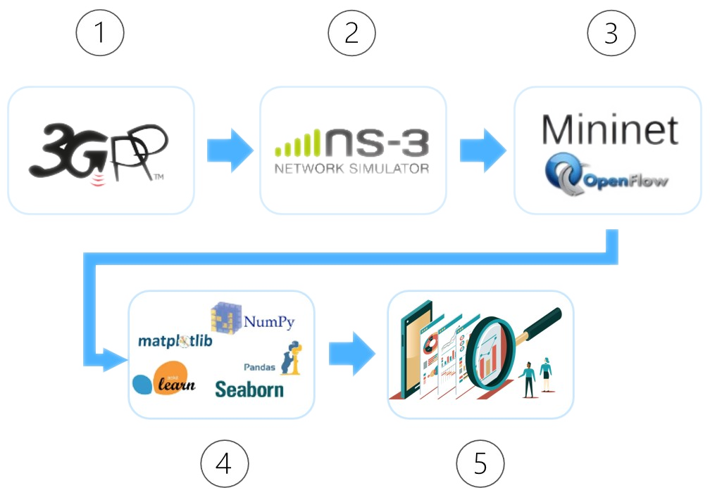

# Dashing Factory
----

[**DASHing Factory**](./docs/paper.pdf) is a modular research platform designed to study, simulate, emulate, and optimize **video streaming and network performance in 5G factory automation environments**. It provides an end-to-end workflow including:

- ***NS-3-based 5G/NR simulation*** : _[5G-LENA](https://5g-lena.cttc.es/)_, realistic channel models.  
- ***Mininet-based link emulation*** : _TC/NetEm_.  
- ***Real DASH streaming*** : [_Caddy_](https://caddyserver.com/) + [_goDash_](https://github.com/uccmisl/godash).  
- ***Dataset generation*** : from logs, trace files, pcaps, and QoE metrics.  
- ***Machine Learning / Deep Learning analytics*** : for QoE prediction and anomaly detection.  

The project is aligned with specifications from _**3GPP**, **5G-ACIA**, **NIST**, and **ISA**_, and targets realistic **Industry 4.0** factory scenarios involving mobile robots, cameras, and delay-sensitive video streaming applications.

<figure>
  
  <figcaption> Outline of the DASHing Factory platform architecture : (1) Scenario
Specification (3GPP-aligned), (2) Network Simulation (NS-3), (3) Network
Emulation (Mininet, Linux TC, NetEm), (4) Data Collection and Processing
(Pandas), and (5) Insights/Predictions (e.g., QoE prediction / anomaly detection - tensorFlow, scikit-learn).</figcaption>
</figure>

## Dataset Information

The dataset comprises +20 features, organized as follows :
|||
|:---------------|:---------------|
|_**Player**-Features_| _**Algorithm**_ : six variantes tested : [_Conventional_](https://ieeexplore.ieee.org/abstract/document/6774592), [_Elastic_](https://ieeexplore.ieee.org/abstract/document/6691442), [_Arbiter +_](https://ieeexplore.ieee.org/document/8334618), [_BBA_](https://dl.acm.org/doi/abs/10.1145/2619239.2626296), [_Logistic_](https://ieeexplore.ieee.org/abstract/document/7442304), [_Exponential_](https://arxiv.org/pdf/1305.0510.pdf).    _**Seg_Dur**_ : _segment duration in ms_,    _**Width**_ & _**Height**_: _in pixels_,    _**Play_Pos**_ : _current Playback position_,    _**Stall_Dur**_ : _stall or freeze  duration in ms_,    _**Buff_Level**_ : _buffer level in ms_|
|_**Application** Features_| _**RTT**_ : _determined using HTTP head request (ms)_,    _**persegment_RTT**_ : _uplink RTT at the network level_,   _**Throughput**_ : _downlink throughput_,    _**Packets**_ : _downlink number of packets_|
|_**Per-Segment** Statistics_ | _**Segment_no**_ : _segment number (60 segments streamed, of 2s each)_,    _**Arr_time**_ : _arrival time,_     _**Del_Time**_ : _delivery of the segment_,    _**Rep_Level**_ : _representation selected for the segment_,    _**Del_Rate**_ : _delivery rate of network_,    _**Act_Rate**_ : _actual rate in Kbps_,    _**Byte_Size**_ : _byte size of this segment_,    _**tag**_ : _target variable in case of Anomaly Detection : 10 classes availables : Normal, or Anomaly injected (duplication, reordering or corruption each with three level of gravity : low 5%, medium 30% or high 60%)_ |
|_**QoE** related features_| five quality of experience models : [_P1203_](https://dl.acm.org/doi/abs/10.1145/3204949.3208124), [_Clae_](https://dl.acm.org/doi/abs/10.1145/2818361), [_Duanmu_](https://ieeexplore.ieee.org/abstract/document/8352759), [_Yin_](https://dl.acm.org/doi/abs/10.1145/2785956.2787486), [_Yu_](https://ieeexplore.ieee.org/abstract/document/7898405).|
|||

The dataset is provided for research and educational purposes only.. The final dataset is available under [_`./dataset/dashing_factory_v03.csv`_](./dataset/dashing_factory_v03.csv). 

## Versioned Directories

The repository contains subfolders for each major version of the Dashing Factory platform. Each version addresses different layers of the pipeline:

- [***Version 01 : Foundational NS-3 Simulation Layer***](./dashing_factory_v01) : foundation for understanding protocol-level behavior of DASH streaming in indoor 5G factories.
- [***Version 02 : Updated Models + High-Quality Datasets***](./dashing_factory_v02) : refined the simulation environment using updated international guidelines:  
  * Traffic profiles based on specifications from _[5G-ACIA](https://5g-acia.org/whitepapers/a-5g-traffic-model-for-industrial-use-cases/)_, _[NIST](https://nvlpubs.nist.gov/nistpubs/ams/NIST.AMS.300-8r1-upd.pdf)_, and _[ISA](https://webstore.ansi.org/standards/isa/isatr10000032011)_.
  * _3GPP [TS 22.104](https://www.3gpp.org/ftp/Specs/archive/22_series/22.104/22104-j20.zip) Rel-19 use cases_.
  * _[InF channel model](https://gitlab.com/andre.ramosp/ns-3-inf-channel-modeling) - 3GPP [TR 38.901](https://www.3gpp.org/ftp/Specs/archive/38_series/38.901/38901-i00.zip)_ 
- _***Version 03 : ML-Driven Analytics Layer*** (current directory) :_ introducing a complete _ML/DL-based anomaly detection framework_.  
  - Extends the pipeline with a Mininet-based emulation layer, where ***tc/netem*** is used to inject controlled network anomalies _(packet reordering, duplication, and corruption)_, each applied at multiple _severity levels_, c.f. [_`./testbed`_](./testbed). 
   - Combined with real DASH traffic and NS-3–derived link conditions, this version :
     - Generates a unified dataset (~22k samples) 
     - Applies ***ML/DL*** models: _SVM, MLP, TabNet, XGBoost_ for _Multi-perspective anomaly detection_ : _Binary classification,   Multi-class (normal, reorder, duplicate, corrupt), High-gravity classification (severity +50%), Fine-grained classification (type × severity)_, c.f. [_`./notebooks`_](./notebooks). 
     - Extensive evaluation and results _(k-fold CV, accuracy/F1 metrics)_.
     - Documentation and visuals provided in joined [paper](./docs/paper.pdf).

## Additional Documentation

For a complete and in-depth description of the emulation pipeline, NS-3 configuration, dataset generation process and ML/DL models please refer to the full research documents: 

_📄 A. Kabou, M. Khanfouci (2025), [DASHing Factory: A Data-Driven Simulation and Emulation Platform for Optimizing 5G Industrial Applications](./docs/paper.pdf), Mitsubishi Electric R&D Centre Europe, Rennes, France._

_📄 Kabou, A., & Khanfouci, M. (2025). [Feature Selection for Data-Driven Optimization: A Case Study on Adaptive Video Streaming in 5G-Enabled Factories.](https://www.researchgate.net/publication/397490434_Feature_Selection_for_Data-Driven_Optimization_A_Case_Study_on_Adaptive_Video_Streaming_in_5G-Enabled_Factories) In 2025 Joint European Conference on Networks and Communications & 6G Summit (EuCNC/6G Summit)._
 

## Acknowledgements
The platform was developed as part of research activities at **Mitsubishi Electric R&D Centre Europe (MERCE), Rennes, France**, within research activities on **QoE-aware networking and 5G industrial systems**. 
The opinions and results presented in this repository are those of the authors and do not necessarily reflect official product developments.

## License
This project is released under the MIT License - see the [`LICENSE`](./LICENCE) file for details.