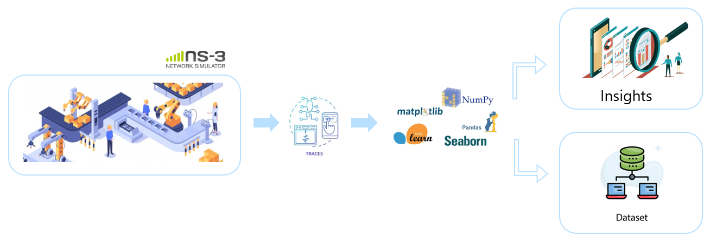
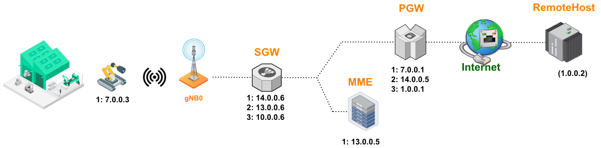

# Dashing Factory (v01)

The repository contains the version (01) of **DASHing Factory**.  The system comprises three principal components as illustrated bellow :

1.  **NS-3 Simulation**: This component involves the use of **ns-3** with **5g-lena module** responsible for the **5G NR part** and the **dash streaming module** responsible for the **DASH streaming application**.

2.  **Trace Files**: The previous simulation outputs a set of trace files. These cover different levels of the simulated scenario, including **physical, mac, RLC, PDCP up to the DASH level itself**.

3.  **Insights and Dataset**: The previous traces are aggregated and analyzed using **Python libraries** such as **pandas, matplotlib, numpy**, etc. to extract insights and illustrate the variation of various metrics collected during simulation. The collected data is cleaned, organized, and exported as a CSV for use afterward.

 

 
  

## 3. Installation and Run
 

The implementation requires the existence of a full functioning ns-3 installation, ideally using the version [_**3.37**_](https://gitlab.com/nsnam/ns-3-dev/-/tree/ns-3.37?ref_type=tags). To install the framework, run simply the script_`install.sh`_. This will do automatically the following :
  
> 1. Add the content of _`contrib/`_, _`scratch/`_ directories to the correspondant folders of the ns-3's installation.
> 
> 2. Add the content of _`./src/internet/model/`_ to the same location into the ns-3's root-directory.
> 
> 3. Copy the folders _`docs/`_, _`bash_scripts/`_and _`scripts/`_ into the ns-3's root-directory.
> 
> 4. Create a folder named _`outputs/`_ at the ns-3's root-directory.
> 
> 5. From the ns-3 root-dir execute _`./ns3 configure --enable-examples`_.
> 
> 6. ns-3 compiles with _`./ns3`_.

To run one simulation compagn, use :

> _bash_cmdz/dashFact_startSimul.sh <nb_nodes>  <nb_run>  <sim_duration>_

Where :

>-  _**<nb_nodes> :**_ the scenario in question, i.e. _12 nodes, 24 nodes, ... 120 nodes_.
>-  _**<nb_run> :**_ to take randomness into account, a simulation is repeated _`nb_run`_ times, each time using randomly generated seed _(named tag in our case)_.
>-  _**<sim_duration> :**_ duration of the streaming session, _9sec_ by default.

## 4. Simulation Setup 
In a prototypical _**Industry 4.0**_ setup, our simulation models a factory with wirelessly connected robots, _c.f fig. bellow_. Each robot, equipped with a _**camera**_, communicates with a central controller on the _**edge**_ network through strategically placed gNBs within the factory.

 

 

The simulation aligns with _**3GPP scenarios**_, referencing specifics like the factory hall's _120x50x10m_ dimensions. This space is divided into _12 service areas_ of 50x10m, accommodating scenario-dependent distributions of _up to 10 UEs per area_. This results in simulations involving 12 to 120 robots, each assigned to a service area. Detailed network deployment and system layout considerations are informed by standards, exemplified by [_Figure 7.2-1: 3GPP TR 38.900 V15.0.0_](https://www.etsi.org/deliver/etsi_tr/138900_138999/138900/15.00.00_60/tr_138900v150000p.pdf).

The simulation engine produces trace files detailing measures across system levels _(DASH, IP, RLC, down to Physical layer)_ describing system dynamics and performance metrics. An exemplar of these files, corresponding to the _"12 nodes"_ scenario with a random seed of _(1464)_, is available in the _`output`_ directory. 

## 4- DASH Streaming

In this investigation, the available bitrate representations derive from the _Big Buck Bunny_ trace file. The video encompasses over _**20 bitrate representations**_, spanning from the lowest quality (Basse) to the highest (4k) at rates of 45,000, 89,000, 131,000, up to 15,000,000 bits per second (in b/s). Each segment comprises 100 frames, with a consistent 20 ms interval between consecutive frames, achieving a frame rate of 50 frames per second _**(50fps)**_. 

The _**adaptive bitrate (ABR)**_ mechanism utilizes the [_**fdash**_](https://www.researchgate.net/publication/288842567_FDASH_A_Fuzzy-Based_MPEGDASH_Adaptation_Algorithm) algorithm, a Fuzzy-Based MPEG/DASH Adaptation Algorithm. Segments are configured for a 2-second playback duration. The ABR algorithm adjusts bitrate by modifying frame size in bytes while maintaining a constant time between frames. The targeted buffering time is set at 35 seconds, with a buffer space of 3MB, and an initial buffer duration of 1 second.

## 5- Collected Metrics and Final Dataset

Within the _`scripts/`_ directory, a collection of scripts is available for extracting insights, plots, statistics, and CSV/feather files from the outputs (trace files) of the simulation engine. Initially, the analysis is conducted on a per-level basis, examining _**DASH, IP, RLC, etc**_ and other parameters for an individual simulation run. Subsequently, the outputs are _**aggregated**_ to distill _**insights**_ and showcase the variations in various metrics gathered throughout the simulation.

Ultimately, the harvested data undergoes a cleaning and organizing process before being exported as a feather file under [_`(dataset/dashing_factory_v01.feather)`_](./dataset/dashing_factory_v01.feather).

