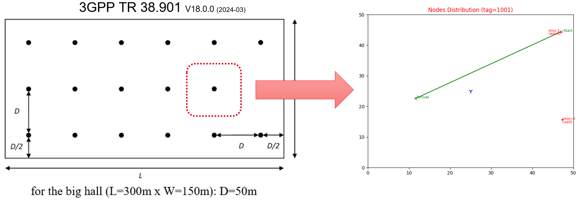

# Dashing Factory (v02)

The repository contains the version (02) of **DASHing Factory**. This version introduces several key improvements over the previous version. This includes :    
-   _**Detailed Use Cases**:_ The study now includes more accurate factory automation use case, reflecting the latest 3gpp specifications _**[TS 22.104](https://www.3gpp.org/ftp/Specs/archive/22_series/22.104/22104-j20.zip)** (release 19 - June 2024)_.    
-   _**Refined Traffic Characteristics**:_ Traffic models have been updated to better represent the specific communication patterns as recommanded by _**[NIST](https://nvlpubs.nist.gov/nistpubs/ams/NIST.AMS.300-8r1-upd.pdf)**_,  _**[ISA](https://webstore.ansi.org/standards/isa/isatr10000032011)**_ and  _**[5G-ACIA](https://5g-acia.org/whitepapers/a-5g-traffic-model-for-industrial-use-cases/)**_.   
-   _**Enhanced Channel Models**:_ The channel models used in the simulation have been revised to include _[InF channel model](https://dl.acm.org/doi/10.1145/3532577.3532596)_, as underlined by the latest 3gpp specifications   _**[TR 38.901](https://www.3gpp.org/ftp/Specs/archive/38_series/38.901/38901-i00.zip)** (release 18 - mars 2024)_.
-   _**Improved Aggregation**:_ The framework now provides a more granular view _(time-series)_ data that tracks how metrics evolve over the duration of the simulation. This enables a deeper investigation on how network conditions impact the video streaming operation and overall QoE.
- _**New QoE Calculation Variants**:_ We’ve expanded the QoE calculation based on the model by [_Yin et al._](https://dl.acm.org/doi/pdf/10.1145/2785956.2787486) to include: 
    * New combinations of parameters _(λ, μ, and μs)_ allowing for different user preferences on which QoE components (rebuffering, video quality variation) are more important.
    * Two time window options are considered for QoE calculation: _short-term_ and _long-term_, providing insights into immediate versus overall user experience.

## **Simulation Setup**
The simulation scenario combines two 3GPP-defined use cases :
  - **_Inspection in Production Systems:_** An AGV streams video feeds for _Quality inspection (use case A.2.3.4)_, 
  - **_Closed-Loop Control:_** A sensor transmits telemetry data in the uplink for _real-time moitoring (use case A.2.3.1)_.
 

 

| **Parameter**       | **Details** |
|---------------------|------------|
| **Factory Layout**  | 50x50m² cell with a **gNB at the center** |
| **AGV Movement**    | Moves at **constant velocity** along a random source-destination path |
| **Sensor UE**       | Randomly placed, transmits **uplink telemetry** |
| **Channel Model**   | **3GPP TR 38.901 Indoor Factory Model** |
| **Sub-Scenarios**   | 4 categories based on **clutter density & antenna height** |
| **Beamforming**     | **Direct path beamforming** (perfect knowledge of pointing angles) |
| **Carrier Frequency** | **3.5 GHz** |
| **Bandwidth**       | **100 MHz** |
| **Scheduler**       | **TDMA Proportional Fair (TDMA-PF)** |
| **Traffic (AGV)**   | **DASH video streaming** for quality inspection (uplink) |
| **Traffic (Sensor UE)** | **Continuous telemetry transmission** (uplink) |
| **Simulation Duration** | **20 seconds per run** |
| **Run Definition**  | Each run is uniquely defined by:   - **AGV source-destination path**   - **Random UE position**   - **Selected factory sub-scenario** |

## Collected Metrics and Final Dataset

The simulation generates _(raw)_ traces from various protocol layers, including  _**Phy, MAC, RLC, PDCP, IP, TCP, DASH**_ , and _**QoE**_. Each trace captures detailed metrics specific to the corresponding layer. Raw traces are then aggregated into two major datasets _(under [`dataset/`](./dataset/))_: a lightweight version with 31 columns and a full version with 79 columns _(cf., the list below)_.

| **Category**       | **Features & Description** |
|---------------------|--------------------------|
| **Physical - MAC** | - **SINR, PathLoss, RSSI:** Signal metrics    - **Tbler (ul/dl):** Transport block error rate    - **MCS (ul/dl):** Modulation and Coding Scheme     - **RV (ul/dl):** Redundancy Version     - **TbSize (ul/dl):** Transport block size     - **Corrupt (ul/dl):** Whether a transport block is corrupted or not  |
| **RLC** | - **PacketSize / Delay:** packet size and delay at the Radio Link Control in uplink/downlink |
| **PDCP** | - **PacketSize / Delay:** at Packet Data Convergence Protocol | 
| **IP** | - **tx/rxPackets:** Per-flow transmitted/received packets  (ul/dl)  - **tx/rxBytes:** Total transmitted/received bytes per flow  (ul/dl)  - **tx/rxOffered:** Offered traffic in Mbps  (ul/dl)  - **meanDelay, meanJitter:** Average delay and jitter at the IP layer (ul/dl)|
| **Mobility** | - **AGV x/y:** Current location of the moving AGV _(i.e., x/y coordinates)_  -  **UE x/y:** UE location _(static per-simulation run)_  - **AGV Velocity:** Velocity of the AGV _(static per-simulation run)_|
| **DASH** | - **Playback Metrics:** Played frames, segment request time, fetch time, segment size   - **Buffering Metrics:** Current buffer time, change in buffer time, estimated average buffer time, initial buffering time    - **Bitrate Metrics:** Tracks segment-level bitrate changes   - **Rebuffering Events:** Number of interruptions, total interruption duration   - **Buffering Queue:** Queue length (segments), queue size (bytes).  |  
| **QoE** | - **qoe_YinX_\***: Computed based on all received segments _(until the current one)_   - **qoe_YinX_\*_short**: Computed based only on the last three segments    - Both are based on the [Yin et al.](https://ieeexplore.ieee.org/document/7113033) model |

A total of _**214 unique deployments**_ were experimented with combining different AGV paths and UE localizations. Each deployment was tested under four sub-scenarios, resulting in a total of _**856 simulation runs**_. The simulations were executed on a VM station equipped with a 25-core Intel Xeon Silver 4114 CPU @ 2.20GHz and 32GB of RAM. The total execution time for all runs summed up to _**299h and 46 min**_.

## Installation and Run

We use the ns-3 version [_3.35_](https://gitlab.com/nsnam/ns-3-dev/-/tree/ns-3.35?ref_type=tags) as required by the _[InF channel model](https://gitlab.com/andre.ramosp/ns-3-inf-channel-modeling)_ extention. We use two additionnal extensions [_5g-Lena (v1.2)_](https://gitlab.com/cttc-lena/nr/-/tree/5g-lena-v2.1.y?ref_type=heads)  and [_djvergad/dash_](https://github.com/djvergad/dash) to simulate, respectivelly, the 5G NR and DASH aspects of our simulation environment. 

To run one simulation compagn, use :
> _bash_cmdz/dashFact_compagn_v2.sh <nb_nodes>  <nb_run>  <sim_duration>_

Where :
>- _**<nb_nodes> :** number of static nodes, e.g., in our case_.
>- _**<nb_run> :** to take randomness into account, a simulation is repeated `nb_run` times, each time using randomly generated seed (named tag in our case)_.
>- _**<sim_duration> :** duration of one streaming session, _9sec_ by default_

