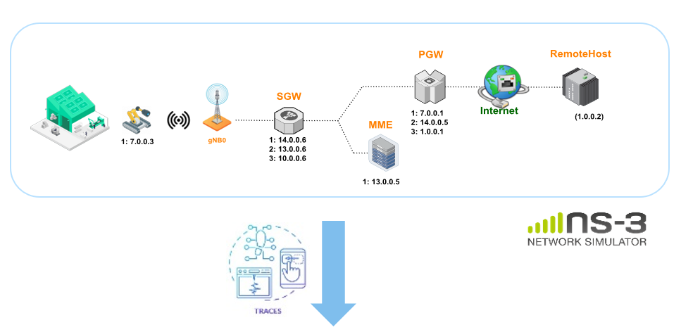
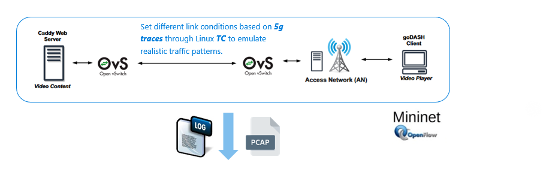

## Brief Overview

The framework is divided into three phases:

1. **ns-3 Simulation :**
    - Utilizes the [_**ns-3**_](https://www.nsnam.org/) simulator with a specific layout simulating a factory environment based on [_3GPP standardization_](https://www.etsi.org/deliver/etsi_tr/138900_138999/138901/16.01.00_60/tr_138901v160100p.pdf).
    - Generates simulation outputs for _throughput_, _delay_, and _jitter_ under _varying degrees of network congestion_ _(c.f. ` ./testbed/5g_traces`)_.

 

 

2. **Mininet Emulation Platform :**
    - Takes the outputs _(traces)_ from the _**ns-3**_ simulation as input to parameterize different link conditions using `tc` and `netem` tools in [_**Mininet**_](http://mininet.org/).
    - Incorporates a DASH server [_**Caddy**_](https://caddyserver.com/) and client [_**goDash**_](https://github.com/uccmisl/godash) supporting various adaptive bitrate algorithms, metrics, and link conditions.
    - Allows injection of _**anomalies** (packet duplication, reordering, corruption)_ with different _gravity levels_.
    - Produces _log files_ and _pcap_ traces for further analysis.

 

 

3. **Data Analysis (Application/Network Layer):**

    - Applies different _data analysis_ techniques to explore the effects of varied inputs on network and application-level measurements.
    - Aims to create a _**comprehensive dataset**_ for subsequent projects focusing on _**Root Cause Analysis (RCA)**_ in the context of  _**Self-Healing**_ and _**Fault Management**_ in networking.

 

 

### Detailled Workflow and Architecture Overview
The testbed is built upon [_**goDASHbed**_](https://github.com/uccmisl/godashbed), a framework utilizing a virtual environment to deliver video content via [_**Mininet**_](http://mininet.org/) virtual emulation tool, [_**Caddy**_](https://caddyserver.com/) web server, and [_**goDash**_](https://github.com/uccmisl/godash) headless video player. The `testbed` directory is expected to host _goDASHbed_, along with a set of Python/shell scripts intended for customizing the framework to suit the specific requirements of the project.

The custimized version is destined to the particular use case of dynamic HAS video streaming in the context of _**5G factory automation**_. In a prototypical Industry 4.0 setup, we consider a factory with wirelessly connected robots _(c.f phase 01)_, each equipped with a camera, communicating with a central controller on the edge network through strategically placed gNBs within the factory.

The assumptions made align with 3GPP scenarios specifications like the factory hall's 120x50x10m dimensions, divided into 12 service areas of 50x10m, accommodating scenario-dependent distributions of up to 10 UEs per area. This results in involving 12 to 120 robots, each assigned to a service area. Detailed network deployment and system layout considerations are informed by standards, i.e. _Table 7.8-7: [ETSI TR 138 901](https://www.etsi.org/deliver/etsi_tr/138900_138999/138901/16.01.00_60/tr_138901v160100p.pdf)_. 

The output of the previous assumptions is a set of trace files, located at _` ./5g_traces`_. The traces are then injected into the _Mininet_ part of the framework. This part is responsable of the launching of a set of video streams using a number of dynamic adaptive algorithms _(Rate-based, buffer-based and hybrid approaches)_, under diverse network conditions.

The platform proceeds to collect various statistics related to different scenarios :
   1. Collected data is first pre-processed in the notebook _`./notebooks/pre-processing.ipynb`_, then
   2. Analysed _(Exploratory Data Analysis (EDA))_ with an interactive interface, i.e. _`./notebooks/interactive-control.ipynb`_, and finally  
   3. Aggregated, cleaned and exported as one CSV file _(`./notebooks/agregate-datasets.ipynb`)_ 

